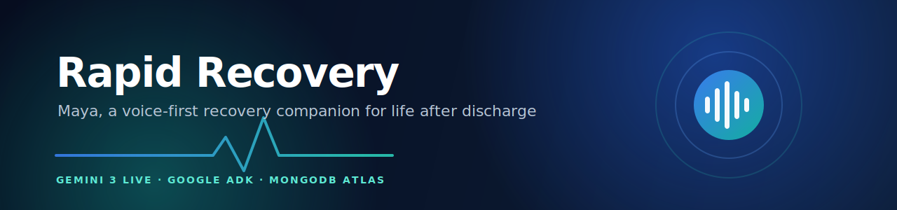
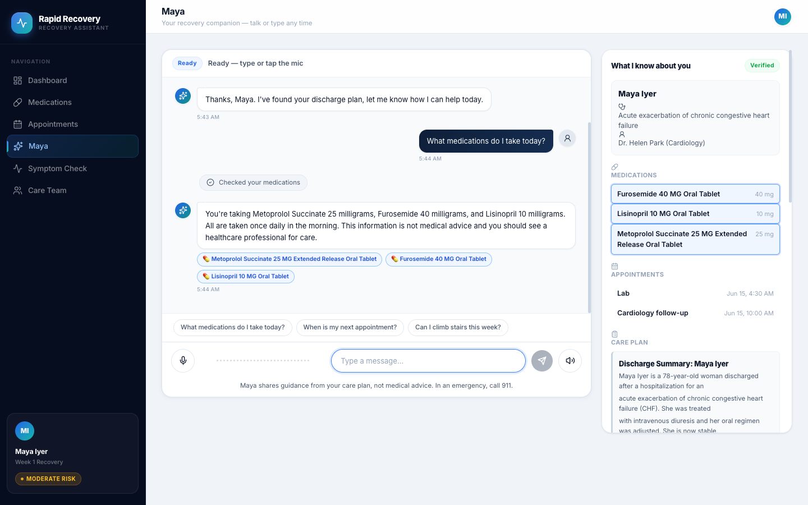
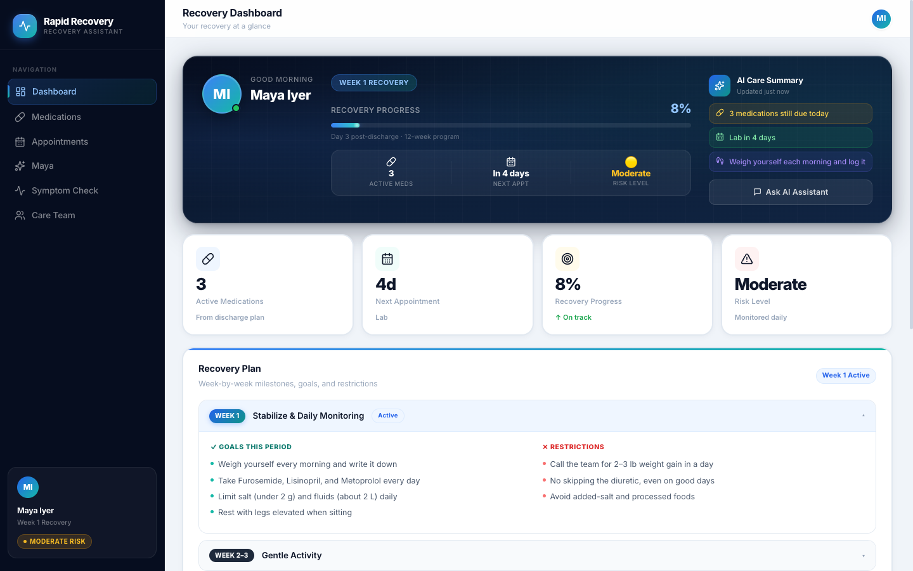
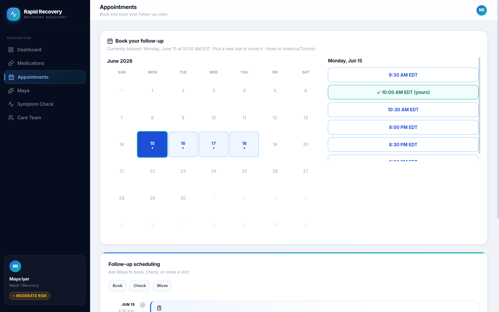
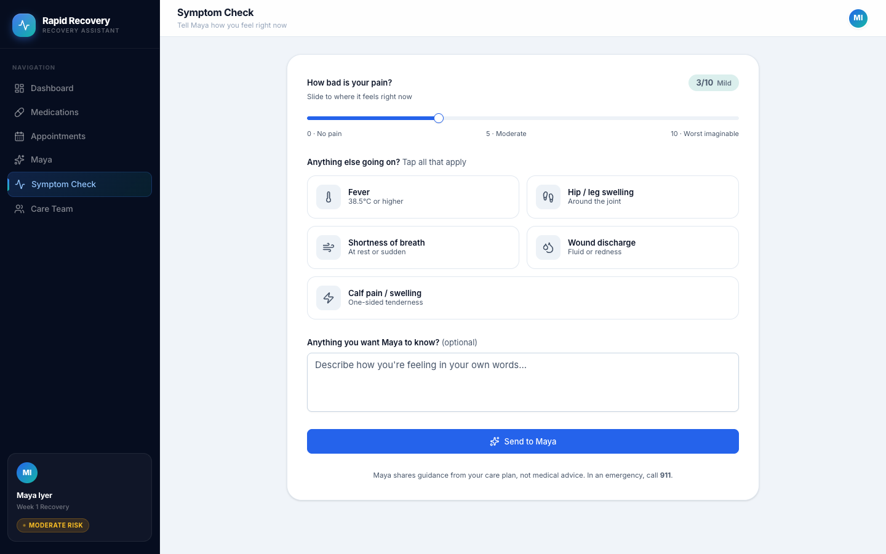
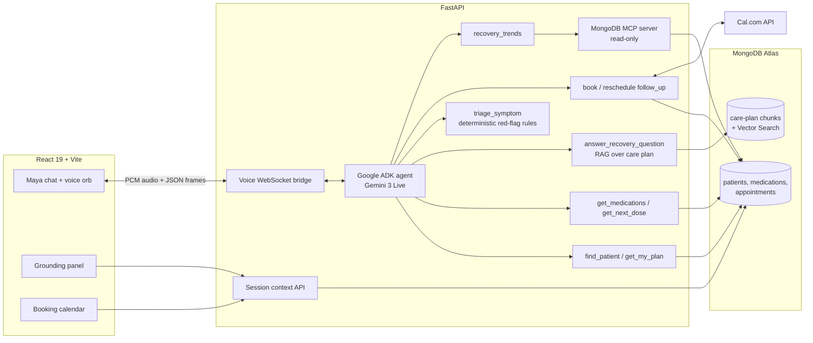

<div align="center">



# Rapid Recovery

**Meet Maya, a voice-first recovery companion for the riskiest two weeks in healthcare: the days right after hospital discharge.**

<p>
  <a href="https://rapid-agent-hackathon.vercel.app/"></a>
  
  
  
  
  
  <a href="LICENSE"></a>
</p>

[Live demo](https://rapid-agent-hackathon.vercel.app/) · [Demo video](#demo-video) · [Quick start](#quick-start) · [Architecture](#architecture)

</div>

---

## The problem

Nearly 1 in 5 patients discharged from US hospitals is readmitted within 30 days. Most of those readmissions start small: a skipped diuretic, a missed warning sign, a follow-up that never got booked. Patients leave with a stack of papers and a phone number that picks up during business hours.

Rapid Recovery gives every discharged patient an agent that has actually read their discharge plan. Maya talks (real-time voice) or types, answers only from the patient's own care plan, runs symptom triage with hard-coded red-flag rules, and books real follow-up appointments. The patient stays in control and sees every tool call she makes.

## What Maya does

| | |
|---|---|
| **Grounded answers, visibly** | Every reply is grounded in the patient's own discharge plan via Atlas Vector Search. The side panel shows exactly which medication, appointment, or care-plan chunk she used, and pulses the source as she cites it. |
| **Acts, not just answers** | Maya books, checks, and reschedules real follow-up visits through Cal.com, inside the patient's clinical follow-up window. A Cal-style calendar widget mirrors the same session, so chat and UI never disagree. |
| **Safety rails** | Symptom check-ins run deterministic red-flag triage (Python rules, not model vibes). Routine symptoms get logged; danger signs escalate with explicit 911 or care-team guidance. Identity is verified before any record is discussed. |
| **Visible reasoning** | Tool calls stream into the chat as a live activity trail: "Checking your medications" spins, resolves, and stays in the transcript as the how-she-got-there record. |

<table>
  <tr>
    <td width="50%"></td>
    <td width="50%"></td>
  </tr>
  <tr>
    <td align="center"><sub>Maya with the live tool trail and grounding panel</sub></td>
    <td align="center"><sub>Dashboard hydrated from the verified session</sub></td>
  </tr>
  <tr>
    <td width="50%"></td>
    <td width="50%"></td>
  </tr>
  <tr>
    <td align="center"><sub>Real Cal.com slots, clamped to the clinical follow-up window</sub></td>
    <td align="center"><sub>Symptom check-in feeds the real triage tools</sub></td>
  </tr>
</table>

## Demo video

> Watch the 3-minute demo: **[link coming with submission]**

Fastest way to try it yourself: open the [live demo](https://rapid-agent-hackathon.vercel.app/), hit **Join**, pick a sample recovery journey, and the app clones a full medical profile (medications, appointments, embedded care plan) under your name. Maya knows you on the next screen. Prefer your own document? Choose **Upload your discharge PDF** in the same wizard ([sample PDF](docs/assets/sample-discharge.pdf)) and Maya answers from it, parsed and indexed on the spot.

## Architecture

One Gemini Live session powers both chat and voice. Identity, grounding, booking, and triage are tools on a single ADK agent, so every safety rule applies to both modalities for free.



Key decisions worth a look:

- **Verification gate.** Tools refuse to run until the session is verified for one patient, whether the patient identified by voice, by text, or deterministically through their onboarded account. The gate lives in session state, not in the prompt.
- **Journey onboarding.** A new user picks a sample recovery journey (heart failure, knee replacement, diabetes, COPD) and the backend clones it into a personal patient profile: their name, real seeded medications with clinical reasons, appointments, and a re-embedded care-plan knowledge base.
- **Tool activity frames.** The WebSocket bridge normalizes ADK live events into typed frames (transcript, audio, tool, sources), so the UI renders Maya's reasoning trail without ever exposing raw model output.
- **Voice-first prompting.** Reply style follows the LiveKit voice-agent prompting guide: answer-first, no narrated lookups, varied phrasing between turns, one greeting per conversation.

## Partner superpowers over MCP

Maya's trends capability runs through the official [MongoDB MCP server](https://github.com/mongodb-js/mongodb-mcp-server). Ask her "how has my week been?" and the `recovery_trends` tool sends a pinned aggregation pipeline (daily check-in buckets, average pain extracted in-pipeline with `$regexFind`, red-flag escalations) to the MCP server, which executes it on Atlas and streams the result back.

Three deliberate choices keep this healthcare-safe:

- **Pinned pipelines.** The model never writes a query. The tool builds the pipeline in Python and scopes it to the verified patient from session state, so a prompt injection cannot reach another patient's data.
- **Read-only.** The server runs with `MDB_MCP_READ_ONLY=true`; even a malformed call cannot write.
- **Graceful degradation.** If the MCP subprocess is unreachable, the tool reports `unavailable` and Maya says so instead of inventing numbers.

## Built for the MongoDB track

MongoDB Atlas is the system of record and the retrieval engine:

- **Operational data** in Beanie ODM collections: patients, medications (with clinical reasons), appointments, users, check-ins, escalations.
- **RAG grounding** through Atlas Vector Search over chunked care plans and clinical guidelines, embedded with Voyage AI (`voyage-3.5`, 1024 dims). `answer_recovery_question` filters by patient, so retrieval can never leak another patient's plan.
- **Journey cloning** copies a sample patient's documents and embeddings into a fresh per-user knowledge base in one idempotent claim operation.

## Tech stack

| Layer | Technology |
|---|---|
| Agent | Google ADK (Agent Builder toolkit), Gemini 3 Flash Live (native audio), Gemini 3 Flash for text |
| Backend | Python 3.11, FastAPI, Beanie ODM, WebSockets |
| Data | MongoDB Atlas, Atlas Vector Search, MongoDB MCP server, Voyage AI embeddings |
| Scheduling | Cal.com API v2 (slots, bookings, reschedules) |
| Frontend | React 19, Vite, React Router 7, Tailwind CSS v4, shadcn/ui, lucide |
| Quality | pytest (241 tests), ruff, mypy, ESLint, TypeScript strict |

## Quick start

Prerequisites: Python 3.11+, Node.js 22+, [uv](https://docs.astral.sh/uv/), [pnpm](https://pnpm.io/).

```bash
git clone https://github.com/mahimairaja/rapid-agent-hackathon.git
cd rapid-agent-hackathon
```

### 1. Backend

```bash
cd backend
cp .env.example .env   # fill in the keys below
uv sync
uv run uvicorn src.main:app --reload --port 8000
```

| Variable | Required | Notes |
|---|---|---|
| `MONGODB_URI` | yes | MongoDB Atlas connection string |
| `GOOGLE_API_KEY` | yes | Gemini API key (AI Studio) |
| `VOYAGE_API_KEY` | yes | Embeddings for seeding and retrieval |
| `JWT_SECRET_KEY` | yes | Any long random string |
| `CAL_API_KEY`, `CAL_USERNAME`, `CAL_EVENT_TYPE_SLUG` | optional | Real booking; the calendar degrades gracefully without them |

API docs at `http://localhost:8000/docs` once running.

### 2. Seed the sample journeys

The Join flow clones from seeded sample patients, so run this once:

```bash
cd backend
uv run python scripts/seed_patients.py      # patients, medications, appointments
uv run python scripts/load_narratives.py    # care plans, chunked and embedded
uv run python scripts/ingest_guidelines.py  # clinical guidelines
uv run python scripts/create_indexes.py     # Atlas Vector Search indexes
```

### 3. Frontend

```bash
cd frontend
pnpm install
pnpm dev
```

Open `http://localhost:5173`, click **Join**, pick a journey, and talk to Maya.

No backend handy? The **Care Provider** portal on the login screen ships with a synthetic demo mode that runs entirely in the browser.

## Testing

```bash
cd backend
uv run pytest          # 241 unit + integration tests
uv run ruff check .
uv run mypy src

cd frontend
pnpm tsc -b && pnpm run lint && pnpm build
```

## Project structure

```text
rapid-agent-hackathon/
├── backend/
│   ├── src/
│   │   ├── agent/        # ADK agent, tools, voice-first prompts
│   │   ├── api/          # REST + voice WebSocket endpoints
│   │   ├── services/     # journey cloning, Cal.com client, triage
│   │   ├── models/       # Beanie documents (MongoDB Atlas)
│   │   └── voice/        # Gemini Live session and event normalization
│   ├── scripts/          # seeding and embedding pipelines
│   └── tests/            # 241 tests
└── frontend/
    └── src/
        ├── components/   # Maya, grounding panel, calendar, dashboard
        ├── lib/          # voice WebSocket client, audio worklets
        └── data/         # journey content, tool labels, mock demo data
```

## License

[MIT](LICENSE)
